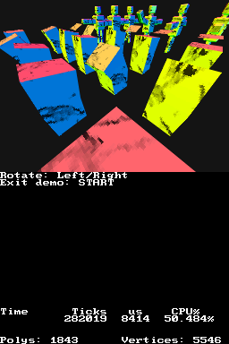

DSMA Library
============

Introduction
------------

**DSMA** (DS Model Animation) is a library that allows you to convert animated
models saved in MD5 format into a format that can be displayed in the Nintendo DS
in a very efficient way. This library depends on **libnds**, which is
distributed by **devkitPro**.

MD5 supports skeletal animation, which lets you reuse the same model with
multiple animations (a **md5mesh** file can be used with multiple **md5anim**
files). This library works in a similar way.

The converter used for this library is called **md5_to_dsma**, and it generates
the following files:

- **DSM** (DS Model): It contains a display list with the geometry of the model.
- **DSA** (DS Animation): It contains the position and orientation of all bones
  in a specific animation sequence. You can have multiple DSA files for a single
  DSM model if you have multiple animations for it.

The library supports interpolation between frames so that DSA files can have a
smaller size by reducing the number of stored frames in it.

You are expected to load the files in some way (either including them as binary
data in your game, or loading them from the filesystem) and pass them to the
functions exposed by the library header.

There are multiple examples of how to use the library in this repository. They
all use libnds, and most of the 3D setup code is generic libnds 3D setup code.
You can test them with an emulator such as **DeSmuME** or **melonDS** or in real
hardware with a flashcard.

- **basic_model**: Simply load an animated model embedded in the binary.
- **filesystem_loading**: Load models from the filesystem (with **nitroFS**).
- **multiple_animations**: Display one model with multiple animations.
- **performance**: Show how much CPU time it takes to draw an animated model.
- **stress_test**: Show multiple animated models with different animations.

You can download them pre-compiled from the **Releases** page on GitHub:

https://github.com/AntonioND/dsma-library/releases

This is an example of multiple models being displayed on the screen:

The library is under the MIT license, and the examples are licensed under the
CC0 license.

To get the latest version of this library, go to the repository:
https://github.com/AntonioND/dsma-library

Generating and converting MD5 models
------------------------------------

You can't use any MD5 model with this library. There is a limit in the number of
bones in the skeleton used in your model. Each bone transformation is stored as
one matrix in the DS matrix stack, which means that you have, at best, space for
29 bones. However, in most cases, the actual space will be smaller (because the
program also uses that space).

Also, it isn't possible to have multiple weights for the same vertex. The MD5
format mandates that all vertices are assigned at least one weight, but
``md5_to_dsma`` will make sure that all vertices have assigned exactly one weight
with a value of 1.0.

You can use any 3D design tool to create your models, as long as you can export
them as MD5 later. Personally, I use blender to generate my models, and I use
this addon https://github.com/KozGit/Blender-2.8-MD5-import-export-addon to
export them as MD5 files. In short: Design your model as usual, making sure that
all your weights are 1.0. Then, clean up the weights of the model (to remove any
weight of 0.0, the exporter will fail if they aren't removed). Make sure that
all the bones have been moved to layer 5 (so that the exporter finds them) and
export the model and animations.

``md5_to_dsma`` can be used to convert a ``md5mesh`` file, a list of ``md5anim``
files, or both at the same time.

Convert all files in one run:

.. code::

    md5_to_dsma.py --model Robot.md5mesh \
                   --name robot \
                   --output out_folder \
                   --texture 128 128 \
                   --anim Wave.md5anim Walk.md5anim Bow.md5anim

Convert the mesh only:

.. code::

    md5_to_dsma.py --model Robot.md5mesh \
                   --name robot \
                   --output out_folder \
                   --texture 128 128

Convert the animations only:

.. code::

    md5_to_dsma.py --anim Wave.md5anim Walk.md5anim Bow.md5anim \
                   --name robot \
                   --output out_folder

Converting textures
-------------------

In order to convert textures you can use some tool like
**nitro-texture-converter**, found here:

https://github.com/AntonioND/nitro-engine/tree/master/tools/nitro_texture_converter

``md5_to_dsma``
---------------

The options supported are:

- ``--output``: Output folder. It will be created if it doesn't exist.

- ``--model``: ``md5mesh`` file to convert. All MD5 models come with a base
  pose, which is exported as a DSA file. The model itself is saved as a DSM
  file.

- ``--texture``: Texture size of the model. This is required. The DS doesn't
  use floating point values for texture coordinates, so you can only use
  textures of the size specified when converting the model. For example, a 32x64
  texture, do ``--texture 32 64``.

- ``--anims``: List of ``md5anim`` files to convert. Each animation is saved as
  a DSA file.

- ``--name``: Base name used for the output files.

- ``--blender-fix``: Blender uses Z as "up" axis, but the DS uses Y as "up".
  This makes it very awkward to export models from Blender to DS. This option
  rotates them by -90 degrees on the X axis so that they use the natural system
  of coordinates of the DS instead of the one of Blender.

- ``--bin``: When this is used, ``.bin`` is added to the end of all the names of
  the files generated by the tool. This is useful if you want to copy the files
  to a ``data`` folder of a libnds template and you don't want to modify the
  ``Makefile`` to accept new file extensions. This option isn't required if you
  are using **libfilesystem**, **libfat** or similar and you're loading files
  from a filesystem.

- ``--export-base-pose``: ``md5mesh`` files contain a base pose. This option
  will export this base pose as a DSA file with one frame.

- ``--skip-frames``: Number of animation frames to skip after exporting each
  frame. For example, to skip half of the frames, do ``--skip-frames 1``, and to
  only export 25% of the frames, do ``--skip-frames 3``.

- ``--draw-normal-polygons``: This is only useful for debugging. It will export
  additional polygons that represent the normals of the model in its base pose
  (they won't move when you animate the model).

Displaying models on the NDS
----------------------------

The library only has two functions:

- ``uint32_t DSMA_GetNumFrames(const void *dsa_file)``

  Returns the number of frames of the animation in a DSA file.

- ``int DSMA_DrawModel(const void *dsm_file, const void *dsa_file, uint32_t frame_interp)``

  Draws the model in a DSM file with the animation in a DSA file.

  The value of the frame to be drawn is a fixed point value (20.12, or ``f32``).
  If the frame is an integer value there is no interpolation between frames. If
  the frame value is between frames the function will interpolate between them.

Future work
-----------

- Smooth shading (only flat shading is supported at the moment).
- Optimize normal commands (if multiple vertices belong to the same joint and
  have the same normal).
- Container files to hold multiple DSM and DSA files.

Thanks to
---------

- **devkitPro**: https://devkitpro.org/
- **Blender**: https://www.blender.org/
- **Blender** addon used to generate models: https://github.com/KozGit/Blender-2.8-MD5-import-export-addon
- MD5 format information: http://tfc.duke.free.fr/coding/md5-specs-en.html
- Quaternion to matrix conversion: http://www.songho.ca/opengl/gl_quaternion.html
- **DeSmuME**: http://desmume.org/
- **melonDS**: https://melonds.kuribo64.net/
